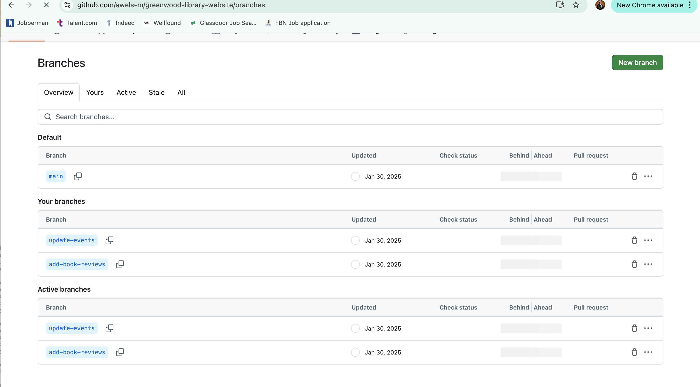

# greenwood-library- website
# Capstone Project - Git

In this project, I will be creating a git repository. after creating it and using the name I was asked to use. I went ahead to clone it on my Terminal  

on the main branch I created some files and attached written content to each of them, 

I staged, committed and pushed the changes to the main branch of the repository. 

## Morgans Work
Here I created a new branch and switched to it. I created a new file and imputed written content into it. I went forward to stage, commit and push changes as well as push the branch to Github.

I went forward to raise a PR for morgans work and merge it with the main branch. 

## Jammie's work 
Here, I repeated the same thing I did on Morgans work. Although I created a new branch as instructed. i ran everything concerning Jammie's work on the n ew branch I created. 

However I ran into this issue below

but I was able to rectify it using the terminal of my VS CODE and with the following command. 

I pulled the latest changes of the main branch to the new branch i created for Jamie before raising the PR. 

attached below are from my iterm concerning all the instructions i followed on my terminal. 

